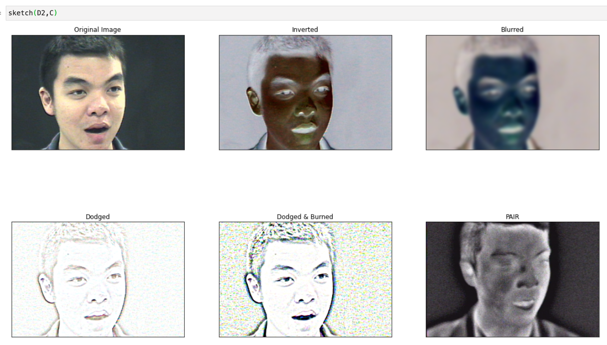

# cv2_proc

Basic thresholding and dodging/burning processes to transform images. Nothing new here, I just centralized everything into one notebook for my investigation into a few basic functions and thought you might find it handy. Refs provided.

Four sample images provided in the `./samples` folder. from the <a href="https://www.flir.com/oem/adas/"> FLIR ADAS</a> dataset and from the publicly available 2013 <a href="http://vcipl-okstate.org/pbvs/bench/">Iris OTCBVS Dataset</a>.

Thresholding:

Dodge and Burn:

